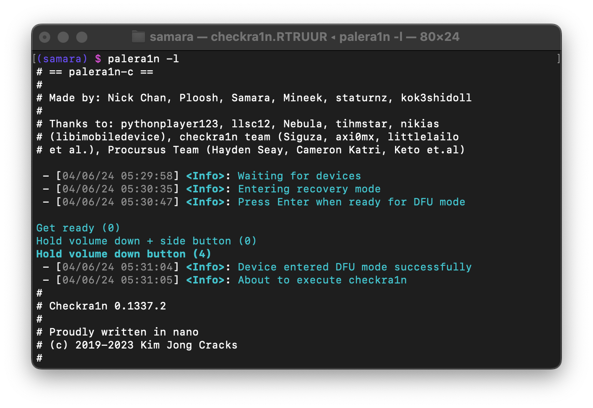
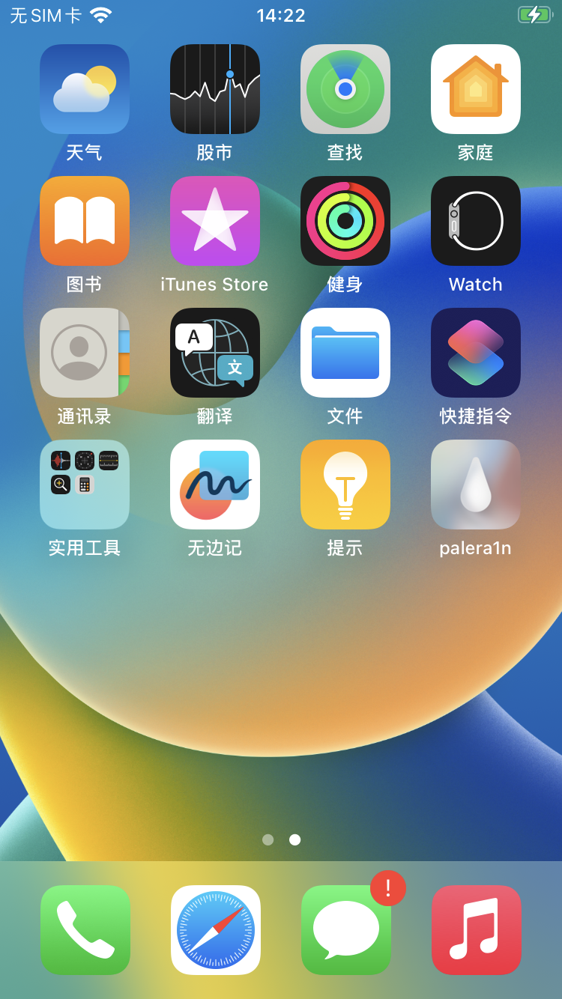
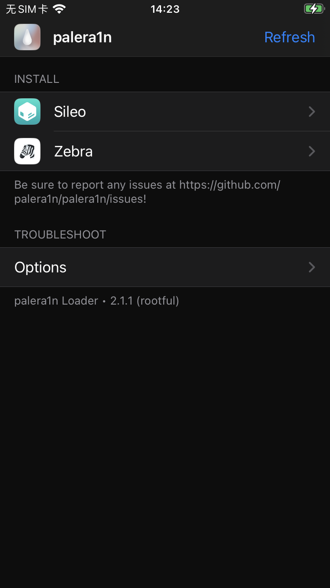
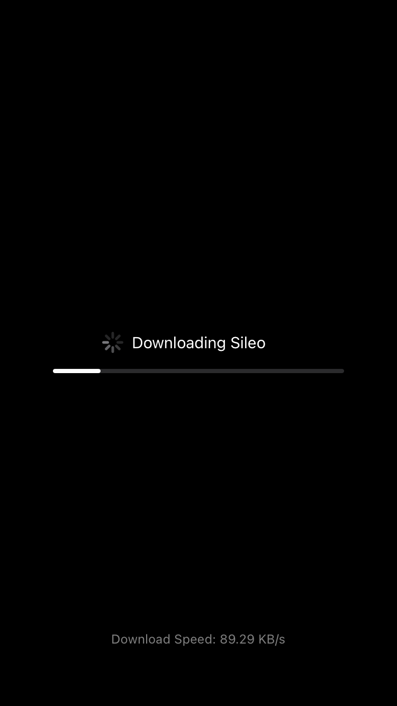
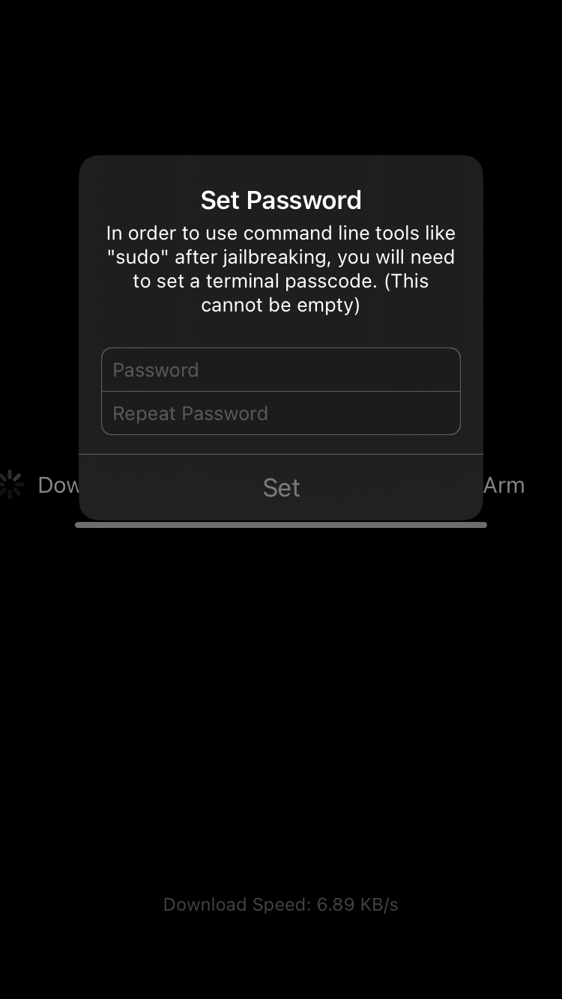
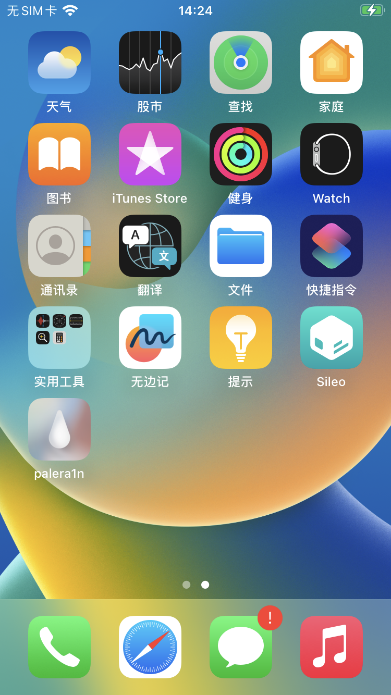

> 本文简要的记录 iOS 16 越狱的大致流程

<!--more-->

## 环境
> * 越狱工具: [Palera1n](https://palera.in/) (A8 ~ A11)
> * 测试设备: iPhone 8 (A11) 、iOS 16.7.10 

## 越狱

> * 无根越狱: palera1n -l (rootless)
> * 有根越狱: palera1n -f (rootful)

### 创建有根越狱 fakeFS

```bash
$ palera1n -f -c
#
# palera1n: v2.0.2 
#
# ========  Made by  =======
# Made by: Nick Chan, Ploosh, Khcrysalis, Mineek, staturnz, kok3shidoll, HAHALOSAH 
# ======== Thanks to =======
# Thanks to: llsc12, Nebula, Lrdsnow, nikias (libimobiledevice),
# checkra1n team (Siguza, axi0mx, littlelailo et al.),
# Procursus Team (Hayden Seay, Cameron Katri, Keto et.al)
# ==========================

 - [12/18/24 14:11:14] <Info>: Waiting for devices
 - [12/18/24 14:11:15] <Info>: Entering recovery mode
 - [12/18/24 14:11:25] <Info>: Press Enter when ready for DFU mode

Hold volume down + side button (0)
Hold volume down button (3)
 - [12/18/24 14:11:39] <Info>: Device entered DFU mode successfully
 - [12/18/24 14:11:40] <Info>: About to execute checkra1n
#
# Checkra1n 0.1337.3
#
# Proudly written in nano
# (c) 2019-2023 Kim Jong Cracks
#
#========  Made by  =======
# argp, axi0mx, danyl931, jaywalker, kirb, littlelailo, nitoTV
# never_released, nullpixel, pimskeks, qwertyoruiop, sbingner, siguza
#======== Thanks to =======
# haifisch, jndok, jonseals, xerub, lilstevie, psychotea, sferrini
# Cellebrite (ih8sn0w, cjori, ronyrus et al.)
#==========================

 - [12/18/24 14:11:40] <Verbose>: Starting thread for Apple TV 4K Advanced board
 - [12/18/24 14:11:40] <Info>: Waiting for DFU mode devices
 - [12/18/24 14:11:43] <Verbose>: DFU mode device found
 - [12/18/24 14:11:43] <Info>: Checking if device is ready
 - [12/18/24 14:11:43] <Verbose>: Attempting to perform checkm8 on 8015 11
 - [12/18/24 14:11:43] <Info>: Setting up the exploit
 - [12/18/24 14:11:43] <Verbose>: == checkm8 setup stage ==
 - [12/18/24 14:11:43] <Verbose>: Entered initial checkm8 state after 1 steps
 - [12/18/24 14:11:44] <Verbose>: Stalled input endpoint after 3084 steps
 - [12/18/24 14:11:45] <Verbose>: DFU mode device disconnected
 - [12/18/24 14:11:45] <Verbose>: DFU mode device found
 - [12/18/24 14:11:45] <Verbose>: == checkm8 trigger stage ==
 - [12/18/24 14:11:45] <Info>: Checkmate!
 - [12/18/24 14:11:45] <Verbose>: Device should now reconnect in download mode
 - [12/18/24 14:11:45] <Verbose>: DFU mode device disconnected
 - [12/18/24 14:11:51] <Info>: Entered download mode
 - [12/18/24 14:11:51] <Verbose>: Download mode device found
 - [12/18/24 14:11:51] <Info>: Booting PongoOS...
 - [12/18/24 14:11:53] <Info>: Found PongoOS USB Device
 - [12/18/24 14:11:54] <Info>: Booting Kernel...
 - [12/18/24 14:11:54] <Info>: Please wait up to 10 minutes for the fakefs to be created.
 - [12/18/24 14:11:54] <Info>: Once the device reboots into recovery mode, run again without the -c (Create FakeFS) option to jailbreak.
```
### 有根越狱

```bash
$ palera1n -f
#
# palera1n: v2.0.2 
#
# ========  Made by  =======
# Made by: Nick Chan, Ploosh, Khcrysalis, Mineek, staturnz, kok3shidoll, HAHALOSAH 
# ======== Thanks to =======
# Thanks to: llsc12, Nebula, Lrdsnow, nikias (libimobiledevice),
# checkra1n team (Siguza, axi0mx, littlelailo et al.),
# Procursus Team (Hayden Seay, Cameron Katri, Keto et.al)
# ==========================

 - [12/18/24 14:19:18] <Info>: Waiting for devices
 - [12/18/24 14:19:19] <Info>: Press Enter when ready for DFU mode

Hold volume down + side button (0)
Hold volume down button (3)
 - [12/18/24 14:19:37] <Info>: Device entered DFU mode successfully
 - [12/18/24 14:19:37] <Info>: About to execute checkra1n
#
# Checkra1n 0.1337.3
#
# Proudly written in nano
# (c) 2019-2023 Kim Jong Cracks
#
#========  Made by  =======
# argp, axi0mx, danyl931, jaywalker, kirb, littlelailo, nitoTV
# never_released, nullpixel, pimskeks, qwertyoruiop, sbingner, siguza
#======== Thanks to =======
# haifisch, jndok, jonseals, xerub, lilstevie, psychotea, sferrini
# Cellebrite (ih8sn0w, cjori, ronyrus et al.)
#==========================

 - [12/18/24 14:19:38] <Verbose>: Starting thread for Apple TV 4K Advanced board
 - [12/18/24 14:19:38] <Info>: Waiting for DFU mode devices
 - [12/18/24 14:19:42] <Verbose>: DFU mode device found
 - [12/18/24 14:19:42] <Info>: Checking if device is ready
 - [12/18/24 14:19:42] <Verbose>: Attempting to perform checkm8 on 8015 11
 - [12/18/24 14:19:42] <Info>: Setting up the exploit
 - [12/18/24 14:19:42] <Verbose>: == checkm8 setup stage ==
 - [12/18/24 14:19:42] <Verbose>: Entered initial checkm8 state after 1 steps
 - [12/18/24 14:19:42] <Verbose>: Stalled input endpoint after 439 steps
 - [12/18/24 14:19:42] <Verbose>: DFU mode device disconnected
 - [12/18/24 14:19:42] <Verbose>: DFU mode device found
 - [12/18/24 14:19:42] <Verbose>: == checkm8 trigger stage ==
 - [12/18/24 14:19:42] <Info>: Checkmate!
 - [12/18/24 14:19:42] <Verbose>: Device should now reconnect in download mode
 - [12/18/24 14:19:42] <Verbose>: DFU mode device disconnected
 - [12/18/24 14:19:49] <Info>: Entered download mode
 - [12/18/24 14:19:49] <Verbose>: Download mode device found
 - [12/18/24 14:19:49] <Info>: Booting PongoOS...
 - [12/18/24 14:19:51] <Info>: Found PongoOS USB Device
 - [12/18/24 14:19:51] <Info>: Booting Kernel...
```
### 安装市场和必要插件

> * 越狱完成后,成功进入系统会显示Palera1n的开机画面
> * 进入SpringBoard后,会有palera1n的图标加载出现(最后一个图标)


**满足以上两点，代表越狱流程顺利完成**




① 点击进入palera1n应用




② 点击Sileo,安装市场





③ 设置SSH, mobile默认密码





④ Sileo市场安装成功




⑤ 进入Sileo市场, 安装好openssh、ellekit和Appsync
### 修改SSH密码
```bash
$ ssh mobile@192.168.1.105
(mobile@192.168.1.105) Password for mobile@iPhone:
```
```bash
$ sudo passwd root

We trust you have received the usual lecture from the local System
Administrator. It usually boils down to these three things:

    #1) Respect the privacy of others.
    #2) Think before you type.
    #3) With great power comes great responsibility.

For security reasons, the password you type will not be visible.

[meow] password for mobile: 
Changing password for root.
Old Password:
New Password:
Retype New Password:

################################### WARNING ###################################
# This tool does not update the login keychain password.                      #
# To update it, run `security set-keychain-password` as the user in question, #
# or as root providing a path to such user's login keychain.                  #
###############################################################################

```
```bash
$ sudo su
iPhone:/private/var/mobile root# whoami
root
iPhone:/private/var/mobile root# 
```
## 参考文献

> * [CFW iOS Guide](https://ios.cfw.guide/get-started/)
> * [玄烨品果](https://dkxuanye.cn/)

